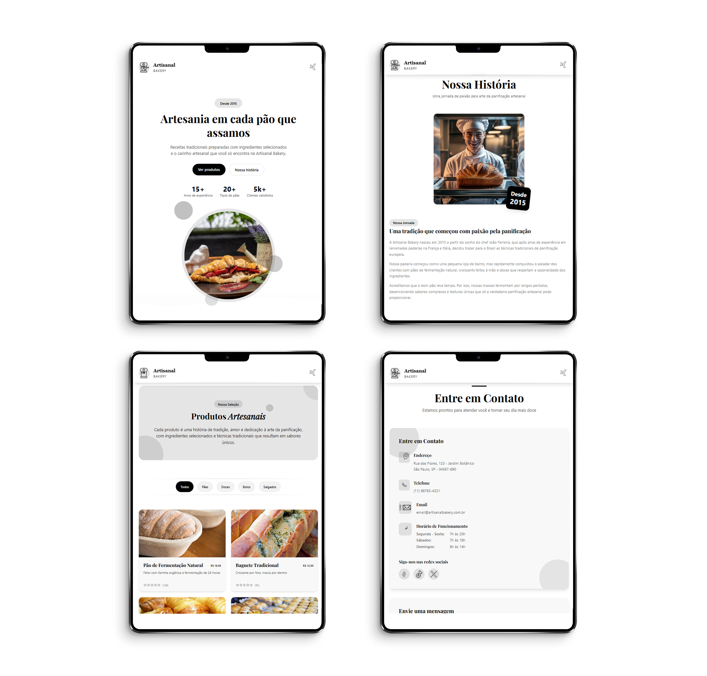

# 🥐 Padaria Artesanal

Uma aplicação web responsiva para uma padaria artesanal que apresenta seus produtos artesanais premium, processos únicos e história da marca.


## 📋 Índice

- [Visão Geral](#-visão-geral)
- [Funcionalidades](#-funcionalidades)
- [Tecnologias Utilizadas](#️-tecnologias-utilizadas)
- [Como Iniciar](#-como-iniciar)
- [Estrutura do Projeto](#-estrutura-do-projeto)
- [Capturas de Tela](#-capturas-de-tela)
  - [Aplicativo](#capturas-de-tela-do-aplicativo)
  - [Interface](#interface-da-aplicação)
  - [Produtos em Destaque](#produtos-em-destaque)
  - [Depoimentos](#depoimentos)
- [Como Contribuir](#-como-contribuir)
- [Licença](#-licença)

## 🔍 Visão Geral

Padaria Artesanal é uma aplicação web moderna que apresenta um autêntico negócio de padaria especializado em pães artesanais, doces e outros produtos de panificação. O site enfatiza o compromisso da padaria com qualidade, métodos tradicionais e ingredientes orgânicos.

## ✨ Funcionalidades

- **Vitrine de Produtos** - Destaque de produtos em destaque com imagens bonitas
- **Seção Sobre** - Conta a história e valores da padaria
- **Design Responsivo** - Otimizado para todos os dispositivos, do mobile ao desktop
- **Depoimentos** - Avaliações e feedback dos clientes
- **Informações de Contato** - Formas fáceis de entrar em contato com a padaria

## 🛠️ Tecnologias Utilizadas

- [React](https://reactjs.org/) - Biblioteca de frontend
- [TypeScript](https://www.typescriptlang.org/) - Segurança de tipos e melhor experiência de desenvolvimento
- [Vite](https://vitejs.dev/) - Ferramentas de frontend de nova geração
- [Tailwind CSS](https://tailwindcss.com/) - Framework CSS utilitário
- [React Router](https://reactrouter.com/) - Roteamento e navegação
- [Framer Motion](https://www.framer.com/motion/) - Biblioteca de animação
- [Lord Icon](https://lordicon.com/) - Ícones animados

## 🚀 Como Iniciar

Siga estas instruções para obter uma cópia do projeto funcionando em sua máquina local.

### Pré-requisitos

- Node.js (v18 ou superior)
- npm ou yarn
- Navegador moderno (Chrome, Firefox, Edge ou Safari)
- Conexão com a internet (para carregamento de ícones e fontes)

### Compatibilidade

O design é totalmente responsivo e otimizado para:
- 📱 Smartphones (iOS e Android)
- 📲 Tablets
- 💻 Desktops e laptops

### Instalação

1. Clone o repositório

   ```bash
   git clone https://github.com/trydavidqix/Artisanal-Bakery.git
   ```

2. Navegue até o diretório do projeto

   ```bash
   cd Artisanal-Bakery
   ```

3. Instale as dependências

   ```bash
   npm install
   # ou
   yarn install
   ```

4. Inicie o servidor de desenvolvimento

   ```bash
   npm run dev
   # ou
   yarn dev
   ```

5. Abra seu navegador e acesse `http://localhost:5173`

## 📁 Estrutura do Projeto

O projeto segue uma estrutura limpa e organizada:

- `src/components` - Componentes de UI reutilizáveis
- `src/pages` - Componentes de nível de página
- `src/hooks` - Hooks React personalizados
- `src/images` - Recursos de imagem
- `src/styles` - Arquivos CSS e utilitários de estilo
- `src/types` - Definições de tipo TypeScript

### Arquitetura

Este projeto segue princípios de arquitetura moderna de frontend:

- **Componentes Funcionais** - Utilizando React Hooks para gerenciamento de estado
- **Design Responsivo** - Layout adaptável para dispositivos móveis e desktop
- **Estilização Modular** - Usando Tailwind CSS para estilos componentes
- **Roteamento** - React Router para navegação entre páginas
- **Lazy Loading** - Carregamento otimizado de imagens e componentes

## 📸 Capturas de Tela

### Capturas de Tela do Aplicativo

<div align="center">
  
  
</div>

👥 Como Contribuir

Contribuições são sempre bem-vindas!

1. Faça um Fork do projeto
2. Crie sua Feature Branch (`git checkout -b feature/AmazingFeature`)
3. Commit suas alterações (`git commit -m 'Add some AmazingFeature'`)
4. Push para a Branch (`git push origin feature/AmazingFeature`)
5. Abra um Pull Request

## 📄 Licença

Este projeto está licenciado sob a Licença MIT - consulte o arquivo [LICENSE](LICENSE) para obter detalhes.

---

Desenvolvido Por [David William](https://github.com/trydavidqix)
