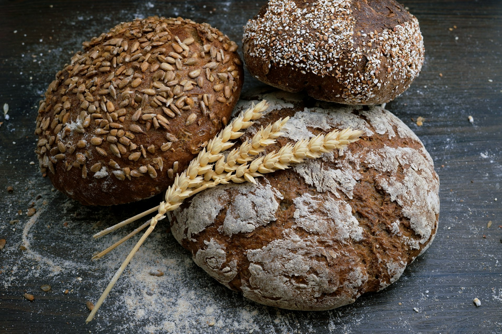

# 🥖 Pão com Amor - Artisanal Bakery

<div align="center">
  
</div>

[](assets/img/large.mp4)
*Click on the image to watch the full video*

## 📝 Description
Institutional website for the artisanal bakery "Pão com Amor", developed with pure HTML, CSS, and JavaScript. The project features a modern and responsive design, focused on user experience and artisanal product presentation.

## ✨ Features

- 🎥 Background video in hero section
- 📱 Responsive mobile menu
- 🖼️ Product gallery with slider
- 👥 Team section with interactive cards
- 📨 Functional contact form
- ⚡ Smooth scroll animations
- 🔄 Custom loading screen
- 🎨 Fully responsive design

## 🛠️ Technologies Used

- HTML5
- CSS3
- JavaScript (ES6+)
- Font Awesome (icons)
- Google Fonts (Poppins)

## 📚 Project Structure
```
bakery/
├── assets/
│ ├── css/
│ │ └── styles.css
│ ├── js/
│ │ └── script.js
│ └── img/
│ ├── pao1.jpg
│ ├── pao2.jpg
│ ├── pao3.jpg
│ ├── pao4.jpg
│ ├── pao5.jpg
│ └── large.mp4
├── index.html
└── README.md
```

## 📱 Responsiveness

The website is fully responsive and adapts to the following breakpoints:

- 📱 Mobile: < 768px
- 📱 Tablet: 768px - 1024px
- 💻 Desktop: > 1024px

## ✨ Website Sections

1. **Home**
   - Background video
   - Main call-to-action
   - CTA button

2. **About Us**
   - Bakery history
   - Differentiators
   - Values

3. **Products**
   - Product grid
   - Prices
   - Descriptions

4. **Gallery**
   - Interactive slider
   - Dot navigation
   - Touch support

5. **Our Team**
   - Member cards
   - Social media links
   - Hover effects

6. **Contact**
   - Contact form
   - Contact information
   - Location

## 🎨 Color Palette

- Primary: `#e67e22`
- Secondary: `#d35400`
- Text: `#333333`

## 📄 License

This project is licensed under the MIT License. See the [LICENSE](LICENSE) file for details.

## 👥 Author

Developed by [Your Name]

---

⭐ If you like this project, please give it a star!
